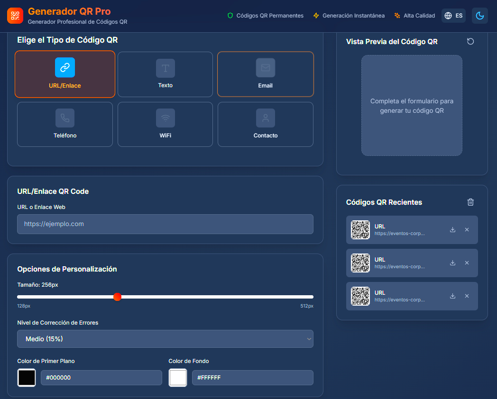

# 🎯 QR Generator Pro

  
  
  
  

  <h3>🚀 Generador Profesional de Códigos QR</h3>
  
App web moderna y completa para generar códigos QR de alta calidad con personalización avanzada

  

---

## ✨ Características Principales

### 🎨 **Interfaz Moderna**
- **Diseño responsive** optimizado para móviles, tablets y desktop
- **Modo oscuro/claro** con transiciones suaves
- **Soporte multiidioma** (Español/Inglés)
- **Animaciones fluidas** y micro-interacciones

### 🔧 **Tipos de QR Soportados**
- 🔗 **URL/Enlaces** - Sitios web y enlaces directos
- 📝 **Texto** - Mensajes y contenido de texto
- 📧 **Email** - Direcciones de correo electrónico
- 📱 **Teléfono** - Números telefónicos
- 📶 **WiFi** - Credenciales de red inalámbrica
- 👤 **Contacto** - Tarjetas vCard con información personal

### 🎯 **Personalización Avanzada**
- **Tamaño variable** (128px - 512px)
- **Colores personalizables** (primer plano y fondo)
- **Niveles de corrección de errores** (L, M, Q, H)
- **Vista previa en tiempo real**

### 💾 **Gestión de Historial**
- **Historial automático** de códigos generados
- **Descarga individual** de códigos QR
- **Eliminación selectiva** de registros
- **Persistencia local** de datos

---

## 🛠️ Tecnologías Utilizadas

### Frontend
- **React 18.3.1** - Biblioteca de interfaz de usuario
- **TypeScript 5.5.3** - Tipado estático
- **Tailwind CSS 3.4.1** - Framework de estilos
- **Vite 5.4.2** - Herramienta de construcción

### Librerías Principales
- **qrcode** - Generación de códigos QR
- **lucide-react** - Iconografía moderna
- **@types/qrcode** - Tipado para QR

---

## 📄 Licencia

Este proyecto está bajo la Licencia MIT.

---

  
⭐ Si te gusta este proyecto, ¡dale una estrella en GitHub! ⭐

  
  

