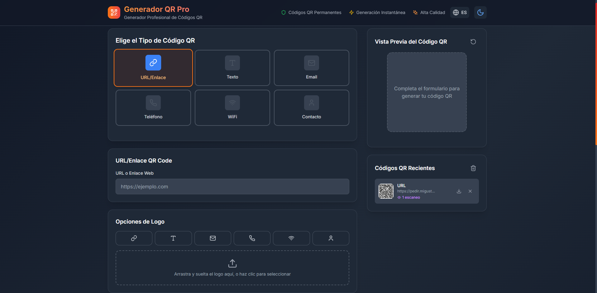
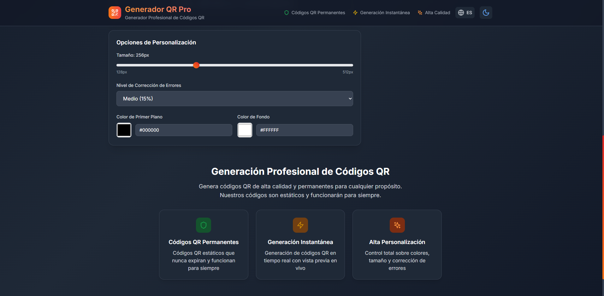

  <h1>✨ QRgenPRO</h1>
  
<strong>Suite Web Moderna & Profesional para la Generación y Gestión de Códigos QR Dinámicos</strong>

  

    
    
  

  

    
    
    
    
    
  

---

### 📌 Descripción para el Repositorio de GitHub
> **QRgenPRO** es una aplicación web moderna y profesional diseñada para crear, personalizar y administrar códigos QR estáticos y dinámicos de alta resolución. Ofrece múltiples formatos (URL, WiFi, vCard, Email), integración de logos personalizados, modo oscuro/claro, historial local y redirección inteligente.

---

## 🖼️ Galería de Capturas

  <table border="0" style="width: 100%; border-collapse: collapse;">
    <tr>
      <td width="50%" align="center" style="padding: 10px;">
        
         
        <b>Vista Principal del Generador</b>
      </td>
      <td width="50%" align="center" style="padding: 10px;">
        
         
        <b>Personalización Avanzada & Previsualización</b>
      </td>
    </tr>
  </table>

---

## ✨ Características Destacadas

### 🎨 **Experiencia de Usuario Premium**
- 🌓 **Modo Oscuro / Claro**: Transiciones fluidas y estética adaptativa elegante.
- 🌐 **Soporte Multiidioma**: Interfaz bilingüe (Español e Inglés).
- 📱 **Diseño 100% Responsive**: Optimizado para dispositivos móviles, tablets y monitores de alta resolución.
- ⚡ **Previsualización en Tiempo Real**: Visualiza cada ajuste de color, logo o tamaño de forma instantánea.

### 🎨 **Personalización y Branding Avanzado**
- 🎨 **Paleta de Colores Flexibles**: Selección de colores en primer plano y fondo con soporte transparente.
- 📐 **Escalabilidad y Resoluciones**: Exportación configurable desde 128px hasta 512px.
- 🖼️ **Incorporación de Logos**: Integración de marcas de agua o logos vectoriales centrados en el código QR.
- 🛡️ **Niveles de Corrección de Errores**: Configuración de niveles L, M, Q y H para asegurar la lecturabilidad aún con daños mecánicos o logos superpuestos.

### ⚡ **Redirección Inteligente & Códigos QR Dinámicos**
- 🔗 **QR Dinámicos (Zero Database & Supabase)**: Redirección mediante parámetros auto-contenidos codificados o almacenamiento en base de datos.
- 📊 **Métricas de Escaneo**: Contador automático de escaneos y registros locales.
- ⏳ **Pantalla de Redirección Pro**: Experiencia de carga personalizada con marca de agua previa al destino.

---

## 🎯 Tipos de Códigos QR Soportados

| Icono | Tipo | Descripción |
| :---: | :--- | :--- |
| 🔗 | **URL / Enlaces** | Redirección directa a páginas web, redes sociales y plataformas digitales. |
| 📝 | **Texto Plano** | Mensajes de texto, notas, claves públicas o información general. |
| 📧 | **Correo Electrónico** | Plantillas preconfiguradas con destinatario, asunto y cuerpo del mensaje. |
| 📞 | **Teléfono** | Marcación directa al escanear desde dispositivos móviles. |
| 📶 | **Red WiFi** | Conexión automática configurando SSID, contraseña y tipo de encriptación (WPA/WEP). |
| 👤 | **Tarjeta vCard** | Tarjeta de contacto digital completa (nombre, teléfono, email, empresa, cargo). |

---

## 💾 Gestión de Historial y Persistencia

- 🕒 **Historial Automático**: Guarda tus códigos QR creados para acceso o reutilización posterior.
- 📥 **Descarga Directa**: Exportación rápida en alta resolución.
- 🗑️ **Gestión Selectiva**: Elimina registros del historial según tus necesidades.
- 🔒 **Privacidad Total**: Almacenamiento local mediante `localStorage` con integración opcional en la nube.

---

## 🚀 Tecnologías Principales

- **React 18** — Biblioteca UI para componentes declarativos y reactivos.
- **TypeScript 5** — Tipado estático robusto para un código seguro y mantenible.
- **Tailwind CSS 3** — Framework estilístico utility-first para un acabado pulcro y moderno.
- **Vite 5** — Bundler ultrarrápido de última generación.
- **Lucide Icons** — Conjunto de iconos vectoriales limpios y modernos.
- **Supabase** — Backend opcional para seguimiento y resolución de códigos QR dinámicos.

---

  
⭐ <i>Si este proyecto te resulta útil, ¡recuerda darle una estrella en GitHub!</i> ⭐

  Desarrollado con ❤️ para ofrecer una experiencia superior en generación de QR

